# Analisis Sentimen Twitter dengan Naive Bayes

Proyek ini adalah pipeline lengkap untuk melakukan **analisis sentimen data Twitter berbahasa Indonesia**, mulai dari preprocessing teks mentah hingga klasifikasi menggunakan **Multinomial Naive Bayes**.

## 🧩 Alur Proyek

```
data mentah (.csv)
      │
      ▼
[1] preprocessing.py
      │  - case folding (lowercase, hapus mention/hashtag/URL/angka/simbol)
      │  - tokenisasi (NLTK)
      │  - stemming (Sastrawi)
      │  - stopwords removal
      ▼
data_preprocessed.csv
      │
      ▼
[2] naive_bayes_classifier.py
      │  - auto-labeling (positif / negatif / netral) berbasis keyword
      │  - split train/test
      │  - ekstraksi fitur: CountVectorizer vs TF-IDF vs N-gram
      │  - training & pemilihan model terbaik
      │  - evaluasi (accuracy, precision, recall, F1, confusion matrix)
      │  - cross-validation 5-fold
      ▼
model + vectorizer (.pkl) + laporan evaluasi
```

## 📁 Struktur Folder

```
.
├── src/
│   ├── preprocessing.py          # Tahap 1: pembersihan & normalisasi teks
│   └── naive_bayes_classifier.py # Tahap 2: training & evaluasi model
├── img/                          # Dokumentasi screenshot hasil eksekusi
├── requirements.txt
└── README.md
```

## ⚙️ Instalasi

```bash
git clone https://github.com/USERNAME/NAMA-REPO.git
cd NAMA-REPO
pip install -r requirements.txt
```

## 🚀 Cara Menjalankan

**1. Preprocessing data mentah**

Data input minimal harus punya kolom `full_text`.

```bash
python src/preprocessing.py --input data_mentah.csv --output data_preprocessed.csv
```

**2. Training & evaluasi model**

```bash
python src/naive_bayes_classifier.py --input data_preprocessed.csv --outdir results/
```

Output yang dihasilkan di folder `results/`:
- `naive_bayes_model.pkl` — model terlatih
- `vectorizer.pkl` — vectorizer (Count/TF-IDF/N-gram) terbaik
- `label_distribution.png` — grafik distribusi label
- `confusion_matrix.png` — confusion matrix model terbaik
- `data_preprocessed_labeled.csv` — data lengkap dengan label

## 🛠️ Teknologi

- **Python** — pandas, numpy
- **NLP**: NLTK (tokenisasi, stopwords), Sastrawi (stemming Bahasa Indonesia)
- **Machine Learning**: scikit-learn (`MultinomialNB`, `CountVectorizer`, `TfidfVectorizer`)
- **Visualisasi**: matplotlib, seaborn

## 📊 Metodologi

Karena dataset tidak memiliki label sentimen bawaan, label dibuat otomatis dengan pendekatan **keyword-based labeling** (kata-kata yang mengindikasikan sentimen positif/negatif). Tiga strategi ekstraksi fitur dibandingkan (Count, TF-IDF, N-gram) dan model dengan akurasi tertinggi dipilih sebagai model final, lalu divalidasi lebih lanjut dengan 5-fold cross-validation.

> Catatan: pendekatan labeling berbasis keyword ini sederhana dan cocok untuk keperluan eksplorasi/portofolio. Untuk keperluan produksi, disarankan menggunakan data berlabel manual atau model labeling yang lebih robust.

## 📸 Dokumentasi

Berikut cuplikan hasil eksekusi tiap tahap pipeline di Google Colab.

### Tahap 1 — Preprocessing (`preprocessing.py`)

| | |
|---|---|
| 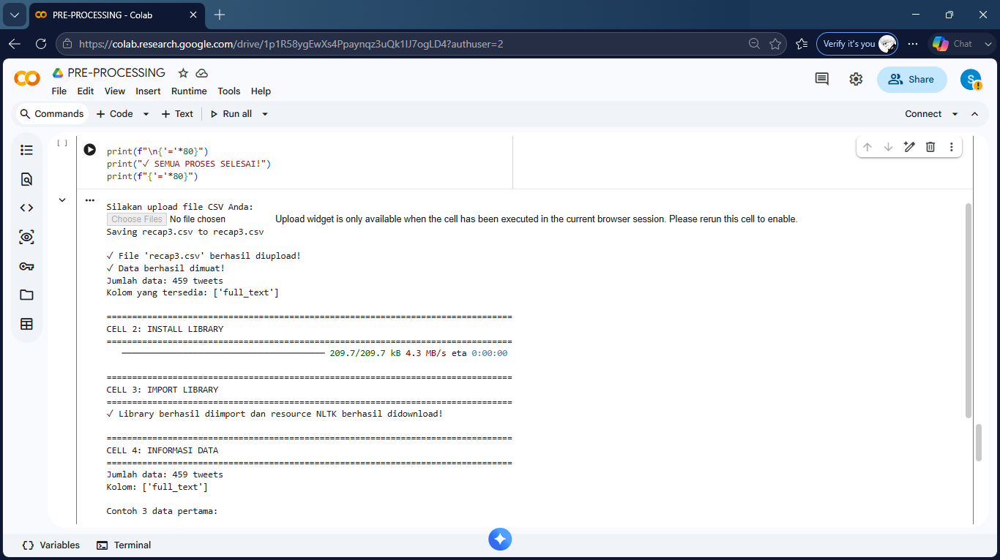 **1. Upload data & info awal**<br>Upload file CSV mentah, install & import library, cek jumlah data (459 tweets) dan kolom `full_text`. | 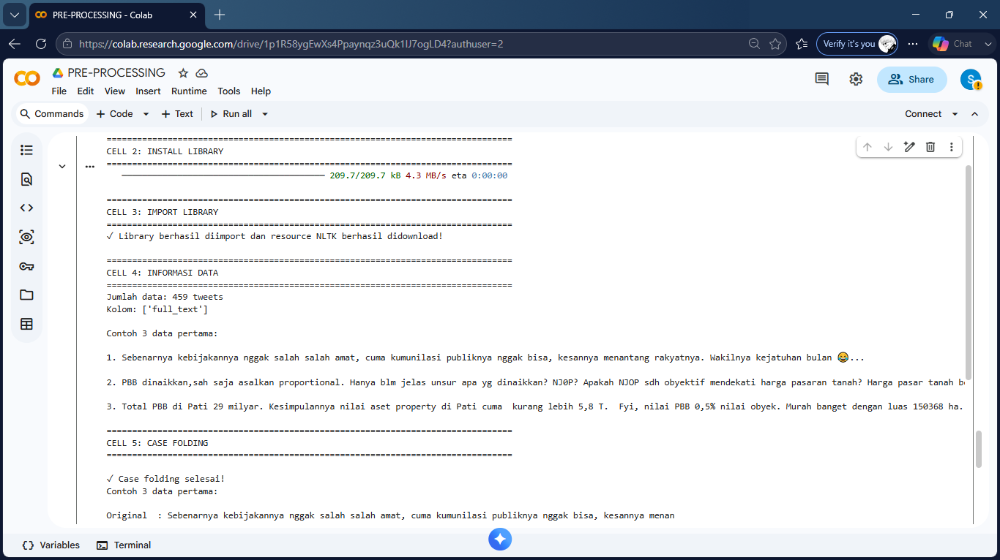 **2. Case folding**<br>Contoh data mentah dan hasil case folding (lowercase, pembersihan simbol/URL/angka). |
| 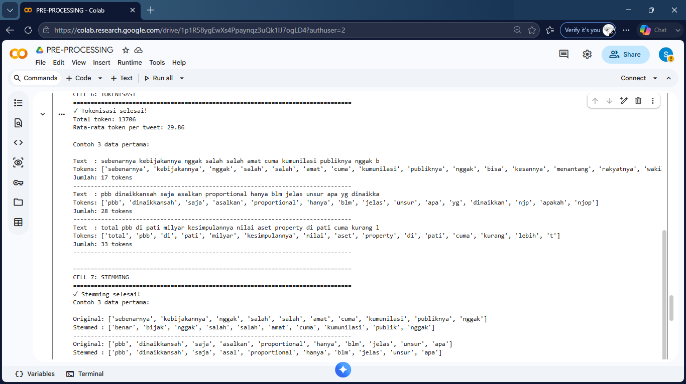 **3. Tokenisasi & stemming**<br>Hasil tokenisasi (13.706 token, rata-rata 29,86 token/tweet) dan stemming menggunakan Sastrawi. | 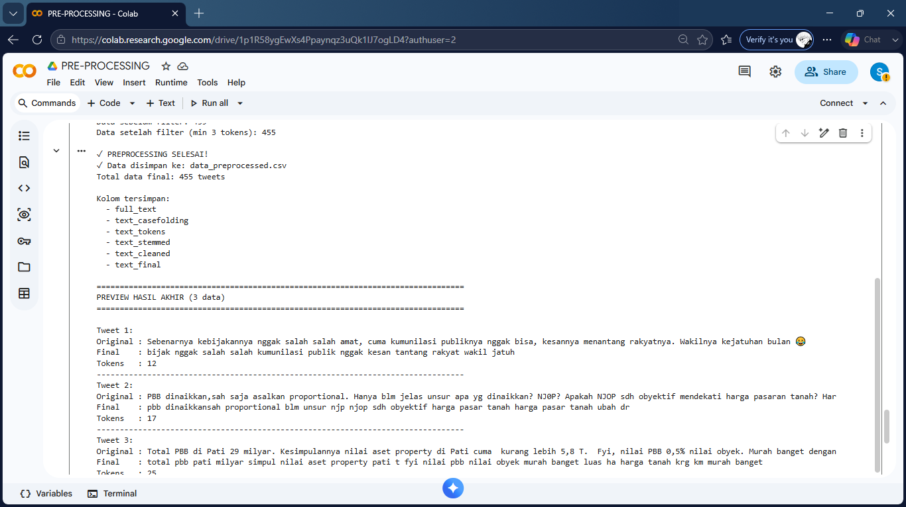 **4. Preview hasil akhir**<br>Data final setelah filtering (455 tweets) lengkap dengan kolom `text_casefolding`, `text_tokens`, `text_stemmed`, `text_cleaned`, `text_final`. |

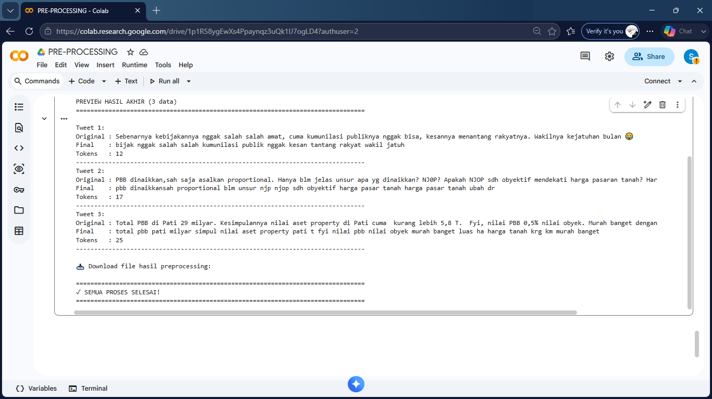
**5. Preprocessing selesai** — perbandingan teks original vs final untuk 3 sampel data, siap diunduh sebagai `data_preprocessed.csv`.

### Tahap 2 — Klasifikasi Naive Bayes (`naive_bayes_classifier.py`)

| | |
|---|---|
| 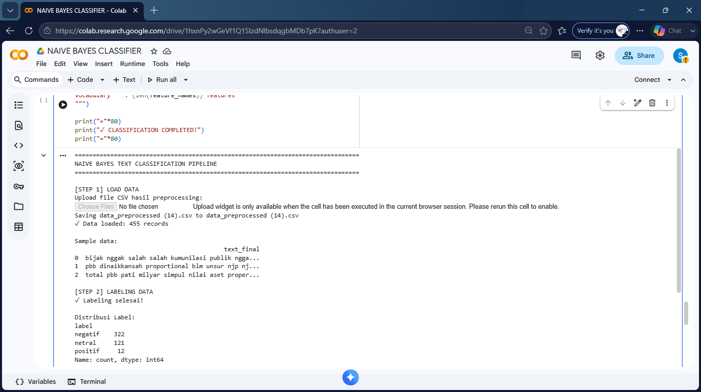 **6. Load data & labeling**<br>Upload data hasil preprocessing (455 records) dan auto-labeling berbasis keyword: negatif (322), netral (121), positif (12). | 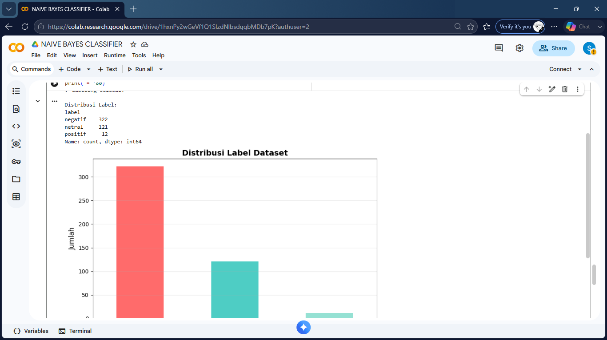 **7. Distribusi label**<br>Visualisasi jumlah data per kelas sentimen. |
| 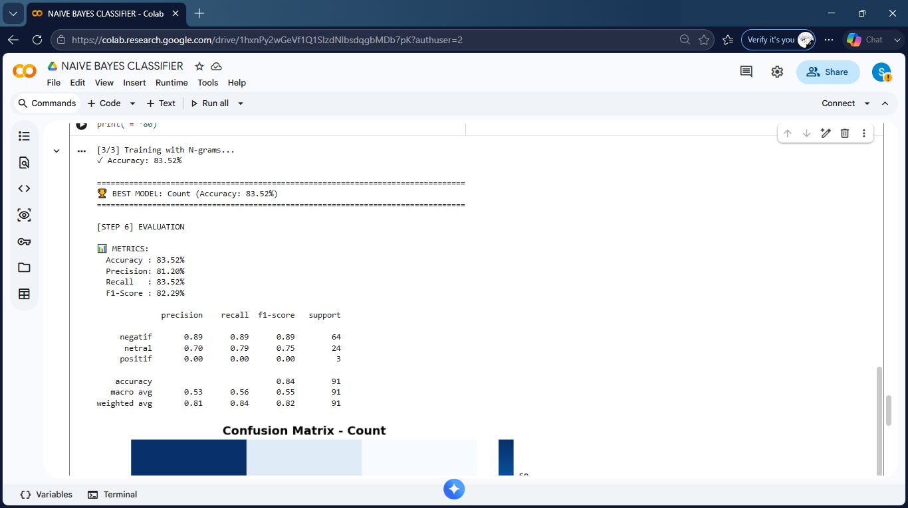 **8. Training & evaluasi**<br>Perbandingan Count vs TF-IDF vs N-gram — model terbaik (Count) mencapai akurasi 83,52% dengan precision/recall/F1-score per kelas. | 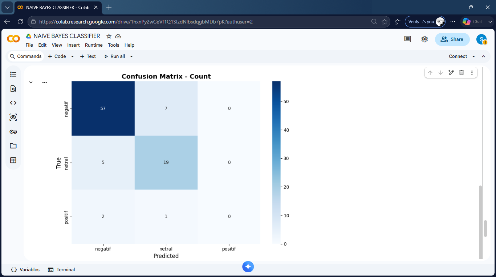 **9. Confusion matrix**<br>Confusion matrix model terbaik (Count vectorizer) pada data uji. |
| 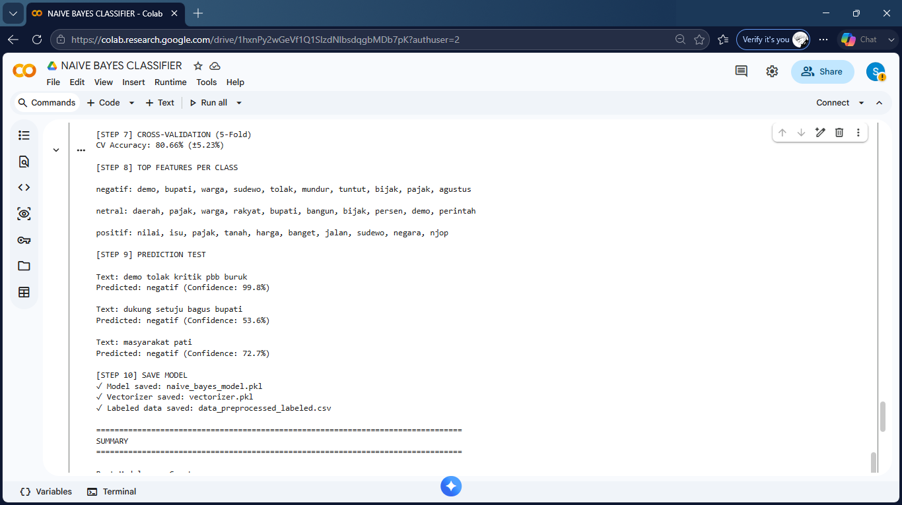 **10. Cross-validation & prediksi**<br>Hasil 5-fold cross-validation (80,66% ± 5,23%), fitur teratas per kelas, dan contoh prediksi teks baru. | 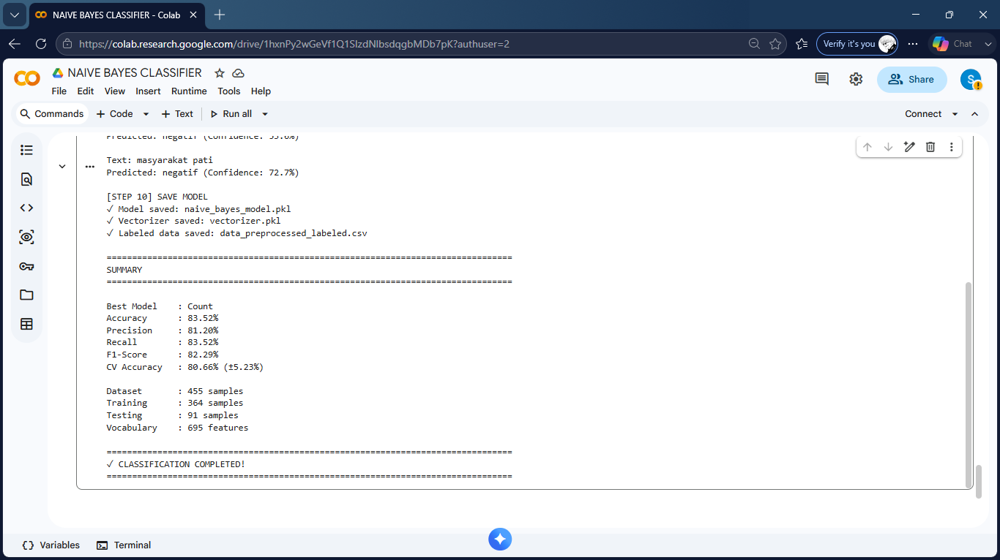 **11. Ringkasan hasil**<br>Model & vectorizer tersimpan (`.pkl`), serta ringkasan akhir: 455 sampel data, 364 training, 91 testing, 695 fitur vocabulary. |

## ✍️ Penulis

Dibuat sebagai bagian dari proyek pembelajaran Natural Language Processing & Machine Learning.